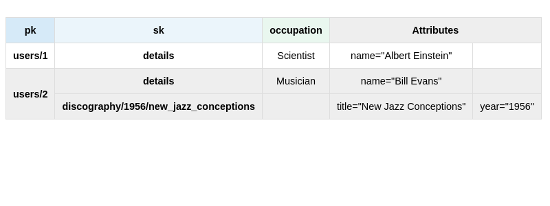

# dynamotableviz - DynamoDB Table Visualizer

CLI tool to create HTML format DynamoDB database designs from text input

## Workflow

Create `example.txt` containing your data in key/value format.

```
pk=users/1,sk=details,name=Albert Einstein,occupation=Scientist
pk=users/2,sk=details,name=Bill Evans,occupation=Musician
pk=users/2,sk=discography/1956/new_jazz_conceptions,title=New Jazz Conceptions,year=1956
```

```bash
./dynamotableviz -pk=pk -sk=sk -attrs=occupation -file ./example.txt
```



## Installation

### Binaries

Download the latest release for your system from [https://github.com/a-h/dynamotableviz/releases](https://github.com/a-h/dynamotableviz/releases)

### Source

If you have Go 1.19+ installed:

```go
go install github.com/a-h/dynamotableviz@latest
```

## Usage

```
Usage of ./dynamotableviz:
  -attrs string
        Defines named attributes, which are then shown as a column (default "gsi1,gsi2,gsi3,ttl")
  -file string
        Load the data from the file instead of stdin
  -omit-css
        Set to true to disable the output of CSS
  -pk string
        Name of the partition key attribute (default "pk")
  -sk string
        Name of the sort key attribute
```

## Custom styling

By default CSS is output. Use the `omit-css` CLI flag to disable it, and write your own.

You can view the default CSS in the `table.templ` file.

## Getting images

Once you've generated your HTML file, you can use Firefox or Chrome in Headless mode to automate the creation of screenshots.

```bash
firefox --headless --screenshot file:///home/user/github.com/a-h/dynamotableviz/index.html
```

```bash
/opt/google/chrome/chrome --headless --window-size=1600,900 --screenshot=screenshot.png --screenshot file:///path/to/file/index.html
```

If you want to customise how it looks, you can use a site generator like Hugo, or automate the merging of the CLI output with custom CSS and HTML.

